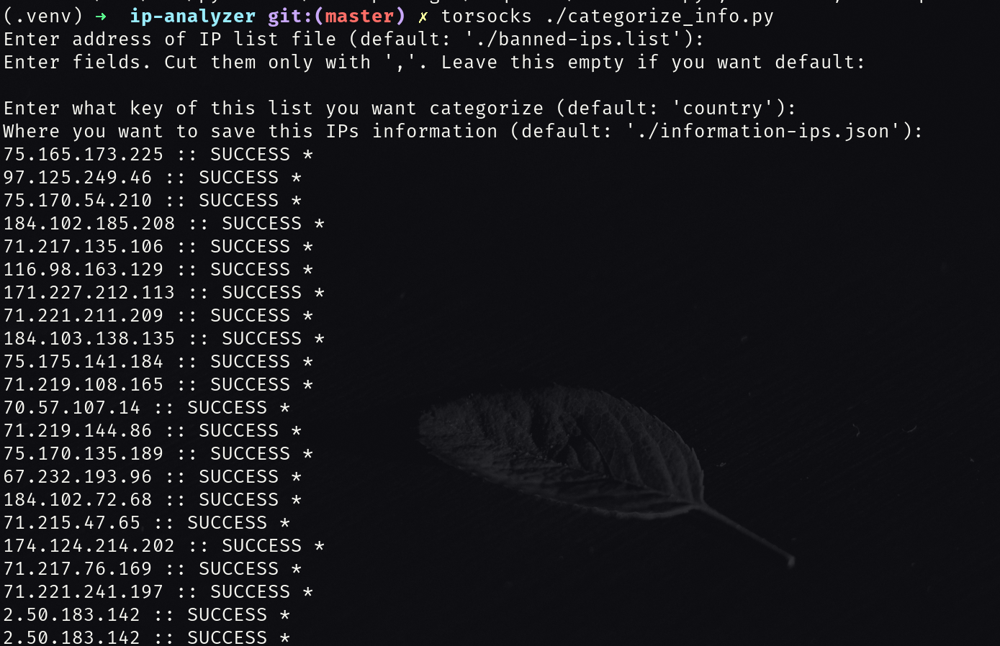
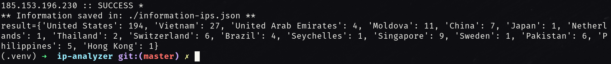
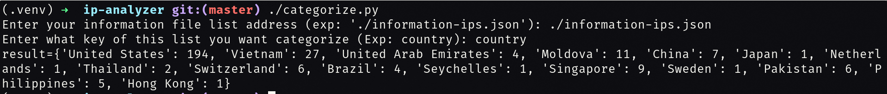
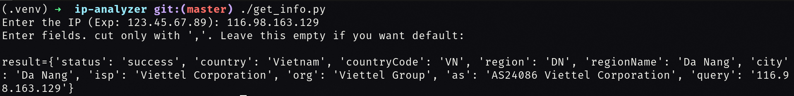

# IP Analyzer
### You can get information of IP list file then analyze them with categorizing
There is several important files:

1. get_info.py

2. categorize.py

3. categorize_info.py [MAIN]

- First file (get_info.py) make a request to [ip-api](http://ip-api.com) website then get information of a IP.
- secend file (categorize.py) read content of a information list file then categorize data with user input fields.
- Third file (categorize_info.py) use two pvious files to get information of a list of IP then categorize them.

## Installation:
```bash
mkdir -p $HOME/.gits/

cd $HOME/.gits/

git clone "https://gitea.com/sabzi/ip-analyzer.git"

cd ip-analyzer/

# Better use a python virtualenv 

pip3 install -r requirements.txt --user
```

## How to use:
You can use all of that three files (get_info.py, categorize.py, categorize_info.py) individually.
But 'categorize_info.py' is our main file.
So we'll teach how to work with 'categorize_info.py' file.
You can execute this file with 'python3' command like this:

```bash
python3 categorize_info.py
```
```
OUTPUT:
Enter address of IP list file (default: './banned-ips.list'): ./banned-ips.list
Enter fields. Cut them only with ','. Leave this empty if you want default:
status,message,country,countryCode,region,regionName,city,isp,org,as,query
Enter what key of this list you want categorize (default: 'country'): country
Where you want to save this IPs information (default: './information-ips.json'): ./information-ips.json
123.45.67.89 :: SUCCESS *
.
.
.
```
- In the first section you must write the exact address of a file that contain list of IP.

- In the next section you must write what kind of fields you want to receive. 

- In the next section you must write what field you want to categorize of calculate.

- In the next section you must write the exact address of a file that you want to save list of information of IP.

  

After insert all of the requirements section, the program will start immediately.
At last the output must be like this:
```
OUTPUT:
.
.
.
987.65.43.21 :: SUCCESS *
** Information saved in ./information-ips.json **
result={'United States': 194, 'Vietnam': 27, 'United Arab Emirates': 4, 'Moldova': 11, 'China': 7, 'Japan': 1, 'Netherlands': 1, 'Thailand': 2, 'Switzerland': 6, 'Brazil': 4, 'Seychelles': 1, 'Singapore': 9, 'Sweden': 1, 'Pakistan': 6, 'Philippines': 5, 'Hong Kong': 1}
```

You can get information of a single IP with 'get_info.py' file like this:

```bash
python3 get_info.py
```

Also you can play with information file of IP (like: 'information-ips.json') with with 'categorize.py' file:

```bash
python3 categorize.py
```


## Screenshots
* Categorize_info command:
 

* Categorize_info result:
 

* Categorize:
 

* Get_info:
 


## Thanks

Special thanks to [ip-api](http://ip-api.com) website for their good and free API service.

And special thanks for you my friend :) <3